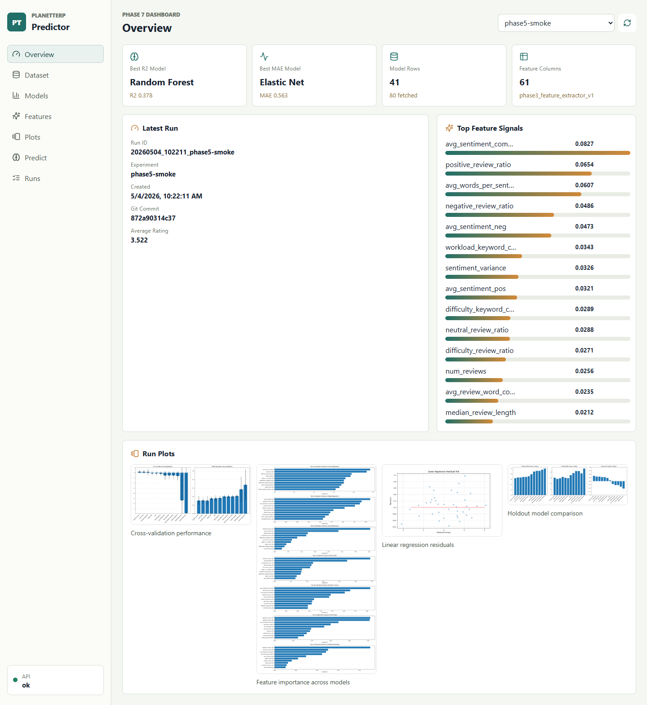

# PlanetTerp Professor Rating Predictor

PlanetTerp Professor Rating Predictor is an end-to-end data science application for exploring how professor review, course, grade, and text features relate to average PlanetTerp ratings. The project started as a single analysis script and has been upgraded into a reproducible local ML platform with data snapshots, experiment tracking, saved model artifacts, a FastAPI backend, a React dashboard, and a growing test suite.

The project is designed to answer three practical questions:

1. What data was used, and how reliable is it?
2. Which model performs best, and what features drive it?
3. How can someone inspect metrics, plots, saved runs, and predictions without reading Python logs?



## Highlights

- Fetches professor and review data from the PlanetTerp API.
- Saves timestamped raw snapshots in `data/raw/` for reproducible experiments.
- Builds dataset summaries and model-ready feature CSVs in `data/processed/`.
- Extracts 60+ features covering review volume, review text, sentiment, course mix, expected grades, keyword categories, and readability.
- Benchmarks mean and median baselines plus linear, regularized, tree, boosting, KNN, and SVR models.
- Runs compact `GridSearchCV` tuning for supported model families.
- Saves local experiment runs with metadata, metrics, plots, feature importance, and `joblib` model bundles.
- Exposes run metadata, metrics, plots, model registry data, predictions, and training through FastAPI.
- Provides a React/Vite dashboard for browsing runs, model metrics, plots, feature importance, and simple predictions.
- Includes Python unit tests and a browser smoke test for the dashboard.

## Current Example Result

The committed local smoke run `20260504_102211_phase5-smoke` used an 80-professor snapshot and retained 41 model-ready professor rows. In that small local run:

| Model | Holdout R2 | RMSE | MAE |
| --- | ---: | ---: | ---: |
| Random Forest | 0.378 | 0.640 | 0.601 |
| Elastic Net | 0.327 | 0.666 | 0.563 |
| Lasso Regression | 0.326 | 0.666 | 0.580 |

These numbers are useful as a functional smoke test, not a final claim about model quality. See [docs/case_study.md](docs/case_study.md) and [docs/limitations.md](docs/limitations.md) for interpretation.

## Project Structure

```text
.
|-- app/                    # React + TypeScript dashboard
|-- api/                    # FastAPI backend
|-- config/                 # Legacy-compatible config constants
|-- data/                   # Ignored raw and processed local artifacts
|-- docs/                   # Methodology, API, data, and dashboard docs
|-- experiments/            # Ignored local experiment run artifacts
|-- outputs/                # Generated plots
|-- planetterp_predictor/   # Package CLI, settings, data artifacts, tracking
|-- src/                    # Data, feature, model, and evaluation modules
|-- tests/                  # Python unit tests
|-- utils/                  # Shared helper functions
|-- main.py                 # Original analysis entry point
|-- pyproject.toml
|-- requirements.txt
`-- upgrade.md
```

## Setup

Use the existing virtual environment if it is already present:

```powershell
.\.venv\Scripts\python.exe --version
```

Or create a fresh environment:

```powershell
python -m venv .venv
.\.venv\Scripts\python.exe -m pip install --upgrade pip
.\.venv\Scripts\python.exe -m pip install -r requirements.txt
.\.venv\Scripts\python.exe -m pip install -e .
```

Install frontend dependencies:

```powershell
cd app
npm install
```

## Data And Training Workflows

Fetch data and save a reproducible snapshot:

```powershell
.\.venv\Scripts\python.exe -m planetterp_predictor data fetch --max-professors 80 --min-reviews 1
```

Validate the latest snapshot:

```powershell
.\.venv\Scripts\python.exe -m planetterp_predictor data validate --snapshot latest
```

Build a model-ready feature CSV:

```powershell
.\.venv\Scripts\python.exe -m planetterp_predictor data build-features --snapshot latest --min-reviews 1
```

Train from a saved snapshot and save experiment artifacts:

```powershell
.\.venv\Scripts\python.exe -m planetterp_predictor run --snapshot latest --min-reviews 1 --experiment-name local-smoke
```

The original script remains available:

```powershell
.\.venv\Scripts\python.exe main.py
```

## API And Dashboard

Start the FastAPI backend:

```powershell
.\.venv\Scripts\python.exe -m planetterp_predictor serve-api --host 127.0.0.1 --port 8000
```

Start the dashboard in a second terminal:

```powershell
cd app
npm run dev
```

Open:

```text
http://127.0.0.1:5173
```

The dashboard reads `http://127.0.0.1:8000` by default. Set `VITE_API_BASE_URL` before `npm run dev` to target another backend.

## Docker Compose Deployment

Phase 10 adds a local Docker Compose deployment for portfolio demos:

```powershell
docker compose up --build
```

Then open:

```text
http://127.0.0.1:5173
```

Compose starts:

- `api`: FastAPI on `http://127.0.0.1:8000`.
- `frontend`: Nginx-served React build on `http://127.0.0.1:5173`.

The API container mounts local `data/`, `experiments/`, and `outputs/` folders so generated snapshots, saved runs, model bundles, and plots persist on the host. See [docs/deployment.md](docs/deployment.md).

## Testing

Run Python tests:

```powershell
.\.venv\Scripts\python.exe -m unittest discover -s tests
```

The Python suite includes FastAPI endpoint tests driven through `TestClient`, covering run artifact reads, model registry responses, prediction validation, and 404 handling.

Run the frontend build:

```powershell
cd app
npm run build
```

With the API and dashboard running, run the browser smoke test:

```powershell
cd app
$env:NODE_PATH="C:\Users\aruba\.cache\codex-runtimes\codex-primary-runtime\dependencies\node\node_modules"
npm run smoke
```

The smoke test uses Playwright with the local Microsoft Edge executable. On another machine, set `EDGE_PATH` if Edge is installed somewhere else.

GitHub Actions CI runs the Python test suite and the frontend production build on pushes and pull requests.

## Documentation

- [docs/dashboard.md](docs/dashboard.md): dashboard views and screenshots.
- [docs/data_dictionary.md](docs/data_dictionary.md): raw fields, processed artifacts, and feature groups.
- [docs/methodology.md](docs/methodology.md): data, feature, modeling, and evaluation methodology.
- [docs/feature_catalog.md](docs/feature_catalog.md): detailed feature catalog and leakage notes.
- [docs/modeling.md](docs/modeling.md): model families, metrics, and tuning.
- [docs/experiments.md](docs/experiments.md): local experiment artifacts.
- [docs/api.md](docs/api.md): FastAPI usage and endpoint examples.
- [docs/deployment.md](docs/deployment.md): Docker Compose deployment guide.
- [docs/limitations.md](docs/limitations.md): known caveats and responsible interpretation.
- [docs/case_study.md](docs/case_study.md): short technical case study.

## Configuration

Defaults live in `planetterp_predictor/settings.py` and can be overridden with `PLANETTERP_` environment variables. See `.env.example` for supported names.

Common settings:

```text
PLANETTERP_MAX_PROFESSORS=1000
PLANETTERP_MIN_REVIEWS=10
PLANETTERP_CV_FOLDS=10
PLANETTERP_OUTPUT_DIR=outputs
```

The project does not automatically load `.env` files. Set variables in the active shell before running commands.
