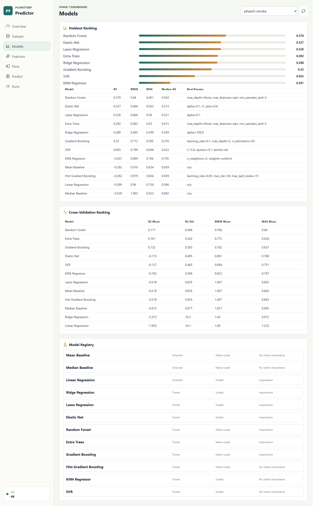
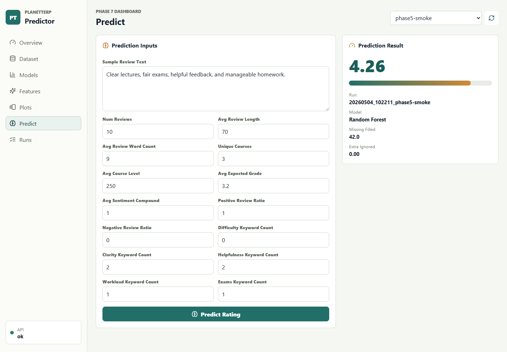

# Dashboard Guide

The Phase 7 dashboard is a React, TypeScript, and Vite frontend that reads local experiment artifacts through the FastAPI backend.

## Start Locally

Terminal 1:

```powershell
.\.venv\Scripts\python.exe -m planetterp_predictor serve-api --host 127.0.0.1 --port 8000
```

Terminal 2:

```powershell
cd app
npm install
npm run dev
```

Open `http://127.0.0.1:5173`.

## Views

### Overview

The overview surfaces the selected run's best model, best MAE model, model-ready row count, feature count, core run metadata, top feature signals, and the first few plot artifacts.


### Dataset

The dataset view displays snapshot metadata, retained model rows, target rating range, and run settings. It is intended to answer what data was used before a model result is interpreted.

### Models

The model comparison view ranks holdout metrics, cross-validation metrics, and model registry metadata.



### Features

The feature importance view shows saved best-model feature importances and the full feature column list used by the selected run.

### Plots

The plot gallery displays run-specific PNG artifacts served from:

```text
/artifacts/runs/{run_id}/plots/{plot_name}
```

### Predict

The prediction view submits a feature payload to `/api/predict`. The text box derives simple helper values for a few text features, while the backend fills omitted saved feature columns with `0.0` when `fill_missing` is true.



### Train

The train view submits real synchronous training requests to `/api/train`. It supports an experiment name, max professor count, minimum review count, latest-snapshot mode, live-API mode, and a save-experiment toggle. Latest-snapshot mode sends `snapshot: "latest"`; live-API mode sends `snapshot: null`.

Because the API endpoint runs training before returning, the dashboard shows an in-progress state until the response arrives. When a saved run is returned in `latest_run_id`, the dashboard refreshes run data and selects that run.

### Runs

The runs view lists saved local experiment folders and the model registry families exposed by the API.

## Configuration

The frontend defaults to:

```text
VITE_API_BASE_URL=http://127.0.0.1:8000
```

Set `VITE_API_BASE_URL` before `npm run dev` or `npm run build` to point the dashboard at a different backend.

## Smoke Test

With the API and dashboard running:

```powershell
cd app
$env:NODE_PATH="C:\Users\aruba\.cache\codex-runtimes\codex-primary-runtime\dependencies\node\node_modules"
npm run smoke
```

The smoke test checks dashboard navigation, prediction, failed responses, console errors, and a mobile overview viewport.
